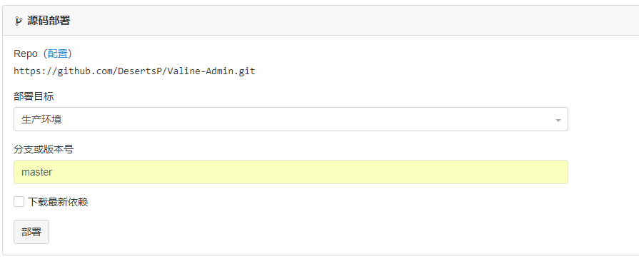
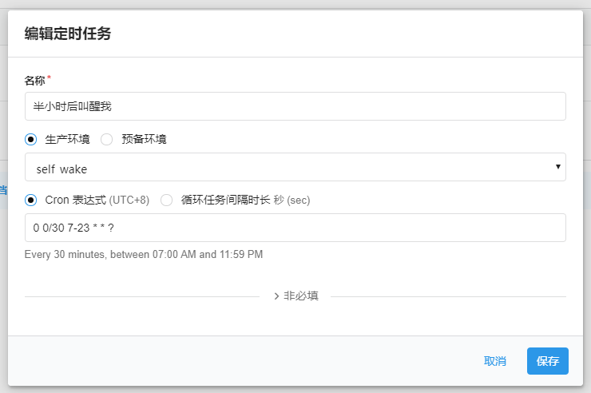
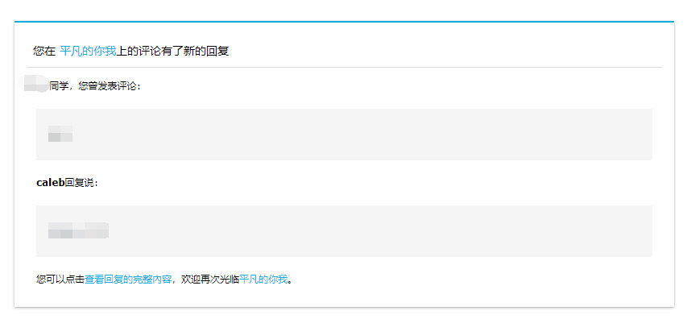

::: tip
Valine Admin 是 Valine 评论系统的扩展和增强，主要实现评论邮件通知、评论管理、垃圾评论过滤等功能。支持完全自定义的邮件通知模板，基于Akismet API实现准确的垃圾评论过滤。

开发者  [@Deserts](https://deserts.io/)
:::


## 云引擎"一键"部署
### 1. 填写代码库
#### 在[Leancloud](https://leancloud.cn/dashboard/#/apps)云引擎设置界面，填写代码库并保存：[https://github.com/DesertsP/Valine-Admin.git](https://github.com/DesertsP/Valine-Admin.git)


### 2.在设置页面，设置环境变量以及 Web 二级域名。


具体格式如下：
| 变量             |                     示例                     |                                                                                                                           说明 |
|------------------|:--------------------------------------------:|-------------------------------------------------------------------------------------------------------------------------------:|
| SITE_NAME        |                  平凡的你我                  |                                                                                                                 [必填]博客名称 |
| SITE_URL         | [https://bcjiangbo.cn](https://bcjiangbo.cn) |                                                                                                                 [必填]首页地址 |
| **SMTP_SERVICE** |                    "163"                     | [新版支持]邮件服务提供商，支持 QQ、163、126、Gmail 以及 [**更多**](https://nodemailer.com/smtp/well-known/#supported-services) |
| SMTP_USER        |                xxxxx@163.com                 |                                                                                                             [必填]SMTP登录用户 |
| SMTP_PASS        |                   XXXXXXXX                   |                                                                                   [必填]SMTP登录密码（QQ邮箱需要获取独立密码） |
| SENDER_NAME      |                    caleb                     |                                                                                                                   [必填]发件人 |
| SENDER_EMAIL     |                xxxxx@163.com                 |                                                                                                                 [必填]发件邮箱 |
| ADMIN_URL        |           https://xxx.leanapp.cn/            |                                                                                            [建议]Web主机二级域名，用于自动唤醒 |
| BLOGGER_EMAIL    |                 xxxxx@qq.com                 |                                                                                   [可选]博主通知收件地址，默认使用SENDER_EMAIL |
| AKISMET_KEY      |                 xxxxxxxxxxxx                 |                                            [可选]Akismet Key 用于垃圾评论检测，设为MANUAL_REVIEW开启人工审核，留空不使用反垃圾 |

**以上必填参数请务必正确设置。**

### 3.切换到部署标签页，分支使用master，点击部署即可

第一次部署可能会需要些时间。


### 4.评论管理
#### 访问设置的二级域名`https://二级域名.leanapp.cn/sign-up` ，注册管理员登录信息，如：[https://nk6vtvs0tdwc.leanapp.cn/sign-up](https://nk6vtvs0tdwc.leanapp.cn/sign-up)


::: warning
注：使用原版Valine如果遇到注册页面不显示直接跳转至登录页的情况，请手动删除_User表中的全部数据。
:::


**此后，可以通过`https://二级域名.leanapp.cn/`管理评论。**

### 5.定时任务设置

**目前实现了两种云函数定时任务:**
::: tip
(1)自动唤醒，定时访问Web APP二级域名防止云引擎休眠；

(2)每天定时检查24小时内漏发的邮件通知。
:::


**进入云引擎-定时任务中，创建定时器，创建两个定时任务。**

(1)选择self-wake云函数，Cron表达式为`0 0/30 7-23 * * ?`，表示每天早6点到晚23点每隔30分钟访问云引擎，ADMIN_URL环境变量务必设置正确：



(2)选择resend-mails云函数，Cron表达式为`0 0 8 * * ?`，表示每天早8点检查过去24小时内漏发的通知邮件并补发：


**添加定时器后记得点击启动方可生效。**

**至此，Valine Admin 已经可以正常工作。**

## 邮件通知模板
### 1.环境变量设定
邮件通知模板在云引擎环境变量中设定，可自定义通知邮件标题及内容模板。

| 环境变量            |                        示例                        |                            说明 |
|---------------------|:--------------------------------------------------:|--------------------------------:|
| MAIL_SUBJECT        | ${PARENT_NICK}，您在${SITE_NAME}上的评论收到了回复 | [可选]@通知邮件主题（标题）模板 |
| MAIL_TEMPLATE       |                       见下文                       |         [可选]@通知邮件内容模板 |
| MAIL_SUBJECT_ADMIN  |              ${SITE_NAME}上有新评论了              |      [可选]博主邮件通知主题模板 |
| MAIL_TEMPLATE_ADMIN |                       见下文                       |      [可选]博主邮件通知内容模板 |


### 2.自定义模板
邮件通知包含两种，分别是 **被@通知** 和 **博主通知**，这两种模板都可以完全自定义。默认使用经典的蓝色风格模板。


@通知模板中的可用变量如下（注，这是邮件模板变量，是指嵌入到HTML邮件模板中的变量，请勿与云引擎环境变量混淆）

| 模板变量       |              说明               |
|----------------|:-------------------------------:|
| SITE_NAME      |            博客名称             |
| SITE_URL       |          博客首页地址           |
| POST_URL       |      文章地址（完整路径）       |
| PARENT_NICK    | 收件人昵称（被@者，父级评论人） |
| PARENT_COMMENT |          父级评论内容           |
| NICK           |          新评论者昵称           |
| COMMENT        |           新评论内容            |

**（1）默认被@通知邮件内容模板如下：**


``` html
<div style="border-top:2px solid #12ADDB;box-shadow:0 1px 3px #AAAAAA;line-height:180%;padding:0 15px 12px;margin:50px auto;font-size:12px;"><h2 style="border-bottom:1px solid #DDD;font-size:14px;font-weight:normal;padding:13px 0 10px 8px;">您在<a style="text-decoration:none;color: #12ADDB;" href="${SITE_URL}" target="_blank">            ${SITE_NAME}</a>上的评论有了新的回复</h2> ${PARENT_NICK} 同学，您曾发表评论：<div style="padding:0 12px 0 12px;margin-top:18px"><div style="background-color: #f5f5f5;padding: 10px 15px;margin:18px 0;word-wrap:break-word;">            ${PARENT_COMMENT}</div><p><strong>${NICK}</strong>回复说：</p><div style="background-color: #f5f5f5;padding: 10px 15px;margin:18px 0;word-wrap:break-word;"> ${COMMENT}</div><p>您可以点击<a style="text-decoration:none; color:#12addb" href="${POST_URL}" target="_blank">查看回复的完整內容</a>，欢迎再次光临<a style="text-decoration:none; color:#12addb" href="${SITE_URL}" target="_blank">${SITE_NAME}</a>。<br></p></div></div>
```
效果如图：


**（2）彩虹风格的@通知邮件模板代码：**

``` html
<div style="border-top:2px solid #12ADDB;box-shadow:0 1px 3px #AAAAAA;line-height:180%;padding:0 15px 12px;margin:50px auto;font-size:12px;"><h2 style="border-bottom:1px solid #DDD;font-size:14px;font-weight:normal;padding:13px 0 10px 8px;">您在<a style="text-decoration:none;color: #12ADDB;" href="${SITE_URL}" target="_blank">            ${SITE_NAME}</a>上的评论有了新的回复</h2> ${PARENT_NICK} 同学，您曾发表评论：<div style="padding:0 12px 0 12px;margin-top:18px"><div style="background-color: #f5f5f5;padding: 10px 15px;margin:18px 0;word-wrap:break-word;">            ${PARENT_COMMENT}</div><p><strong>${NICK}</strong>回复说：</p><div style="background-color: #f5f5f5;padding: 10px 15px;margin:18px 0;word-wrap:break-word;"> ${COMMENT}</div><p>您可以点击<a style="text-decoration:none; color:#12addb" href="${POST_URL}" target="_blank">查看回复的完整內容</a>，欢迎再次光临<a style="text-decoration:none; color:#12addb" href="${SITE_URL}" target="_blank">${SITE_NAME}</a>。<br></p></div></div>
```
效果如图：


博主通知邮件模板中的可用变量与@通知中的基本一致，***PARENT_NICK*** 和 ***PARENT_COMMENT*** 变量不再可用。


**（3）默认博主通知邮件内容模板如下：**
``` html
<div style="border-top:2px solid #12ADDB;box-shadow:0 1px 3px #AAAAAA;line-height:180%;padding:0 15px 12px;margin:50px auto;font-size:12px;"><h2 style="border-bottom:1px solid #DDD;font-size:14px;font-weight:normal;padding:13px 0 10px 8px;">您在<a style="text-decoration:none;color: #12ADDB;" href="${SITE_URL}" target="_blank">${SITE_NAME}</a>上的文章有了新的评论</h2><p><strong>${NICK}</strong>回复说：</p><div style="background-color: #f5f5f5;padding: 10px 15px;margin:18px 0;word-wrap:break-word;"> ${COMMENT}</div><p>您可以点击<a style="text-decoration:none; color:#12addb" href="${POST_URL}" target="_blank">查看回复的完整內容</a><br></p></div></div>
```
因为没使用过这个，所以就没挂图~~~

**（4）彩虹风格的博主通知邮件内容模板如下：**
``` html
<div style="border-radius: 10px 10px 10px 10px;font-size:13px;    color: #555555;width: 666px;font-family:'Century Gothic','Trebuchet MS','Hiragino Sans GB',微软雅黑,'Microsoft Yahei',Tahoma,Helvetica,Arial,'SimSun',sans-serif;margin:50px auto;border:1px solid #eee;max-width:100%;background: #ffffff repeating-linear-gradient(-45deg,#fff,#fff 1.125rem,transparent 1.125rem,transparent 2.25rem);box-shadow: 0 1px 5px rgba(0, 0, 0, 0.15);"><div style="width:100%;background:#49BDAD;color:#ffffff;border-radius: 10px 10px 0 0;background-image: -moz-linear-gradient(0deg, rgb(67, 198, 184), rgb(255, 209, 244));background-image: -webkit-linear-gradient(0deg, rgb(67, 198, 184), rgb(255, 209, 244));height: 66px;"><p style="font-size:15px;word-break:break-all;padding: 23px 32px;margin:0;background-color: hsla(0,0%,100%,.4);border-radius: 10px 10px 0 0;">您在<a style="text-decoration:none;color: #ffffff;"href="${SITE_URL}">${SITE_NAME}</a>上有新评论啦！</p></div><div style="margin:40px auto;width:90%"><p>${NICK}给您的回复如下：</p><div style="background: #fafafa repeating-linear-gradient(-45deg,#fff,#fff 1.125rem,transparent 1.125rem,transparent 2.25rem);box-shadow: 0 2px 5px rgba(0, 0, 0, 0.15);margin:20px 0px;padding:15px;border-radius:5px;font-size:14px;color:#555555;">${COMMENT}</div><p>您可以点击<a style="text-decoration:none; color:#12addb"href="${POST_URL}#comments">查看回复的完整內容</a>，欢迎再次光临<a style="text-decoration:none; color:#12addb"href="${SITE_URL}">${SITE_NAME}</a>。</p><style type="text/css">a:link{text-decoration:none}a:visited{text-decoration:none}a:hover{text-decoration:none}a:active{text-decoration:none}</style></div></div>
```
效果如图：


**以上所有内容供大家参考，有问题请及时指正，如有侵权，请及时联系删除**

:::tip
本文作者 [caleb](https://github.com/ACchenjiangbo)，博客 [平凡的你我](https://bcjiangbo.cn/)。
:::
### **完结撒花:tada::tada::tada:**
