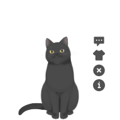

## Introduce



kan-ban-niang plugin for vuepress-theme-reco or other vuepress theme.  

### Name

- **As plugin**: `@vuepress-reco/vuepress-plugin-kan-ban-niang`
- **As component**: `KanBanNiang`（自动出现在页面中，无需添加额外代码）

## Option API

> 以下为插件注入时的参数。

**Attributes**

### tothemetal

- description: 默认模型主题
- type: `String`
- default: `blackCat`
- accepted-values: 见最后

### message

- description: 主人寄语
- type: `String`
- default: welcome to `您的站点名称（$site）`
- accepted-values: 见最后

### messageStyle

- description: 自定义消息框样式
- type: `Object`
- default: 
    ```json
    { 
      position: 'fixed', 
      right: '80px', 
      bottom: '195px'
    }
    ```

### modelStyle

- description: 自定义模型样式
- type: `Object`
- default: 
    ```json
    { 
      position: 'fixed', 
      right: '90px', 
      bottom: '-20px', 
      opacity: '0.9'
    }
    ```

### width

- description: 模型宽度
- type: `Number`
- default: `150`

### height

- description: 模型高度
- type: `Number`
- default: `220`


## theme可选值


## About

参考插件: [@Qi](https://github.com/QiShaoXuan) https://github.com/QiShaoXuan/vuepress-plugin-cat  
模型库： [@Qi](https://github.com/QiShaoXuan) https://github.com/QiShaoXuan/live2DModel
